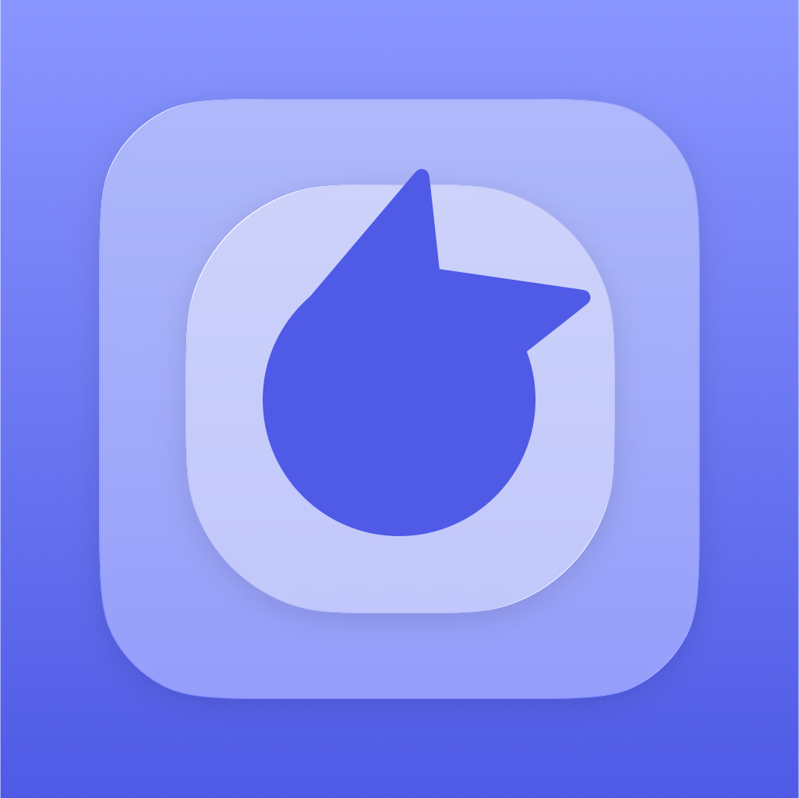
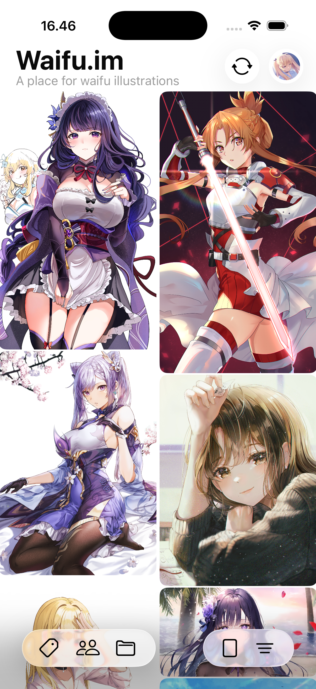
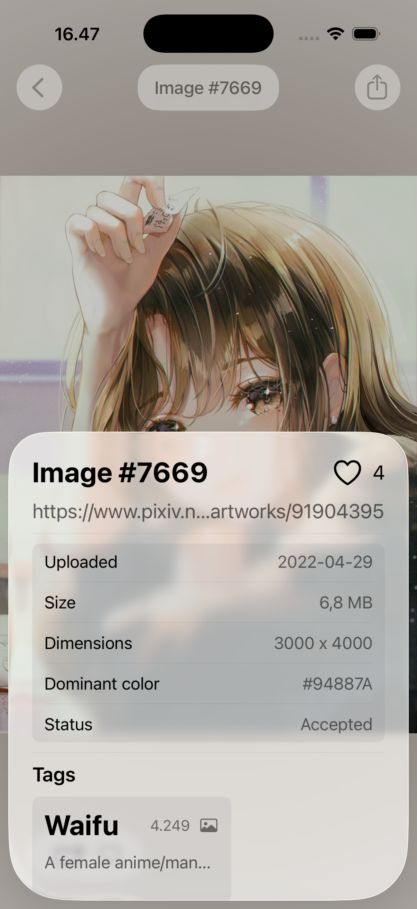
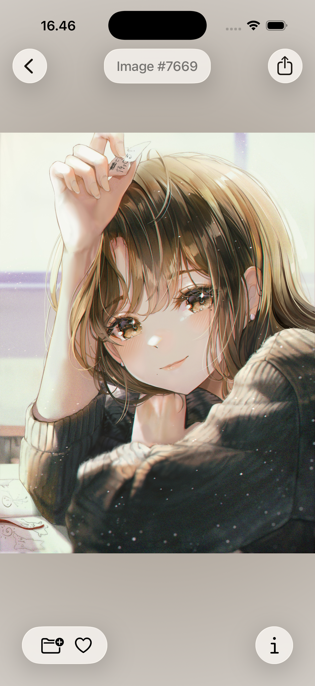
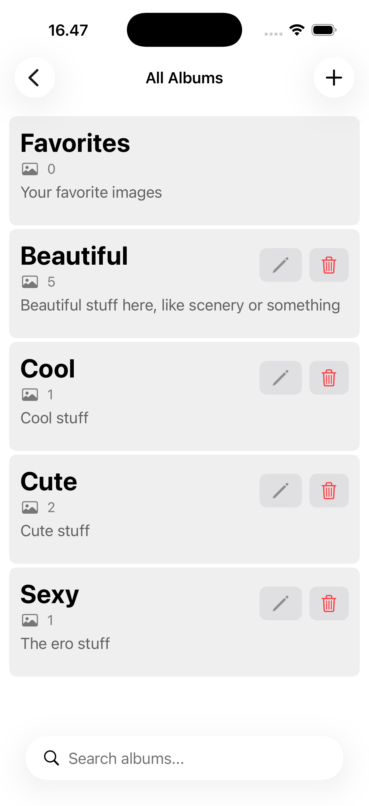

# Waifu.im iOS Client

A native, high-performance iOS application built to browse, filter, and organize high-quality anime illustrations powered by the [waifu.im](https://waifu.im) API. This project was developed as a deep dive into modern SwiftUI networking patterns and local data persistence.

  

## Project Description

The Waifu.im Client serves as a streamlined interface for the waifu.im platform, allowing users to explore a vast library of anime art with ease. Beyond simple API consumption, the app focuses on a seamless user experience through asynchronous image loading, intelligent caching, and a custom album management system. It was designed to explore the boundaries of SwiftUI's declarative syntax when handling complex, media-heavy data streams.

  
  
  
  

## Tech Stack

* **Framework**: SwiftUI (Declarative UI)
* **Language**: Swift 6
* **Persistence**: [KeychainAccess](https://github.com/kishikawakatsumi/keychainaccess)
* **Networking**: Native URLSession with Async

## Key Features

* **Advanced Filtering**: Leverages the waifu.im API to filter by tags, dimensions, and color profiles.
* **Collections Management**: Create custom albums to organize saved content.
* **Metadata Insights**: View detailed image information including dominant colors, source links, and upload dates.
* **Responsive Layout**: A fluid grid system that adapts to various iPhone screen sizes.

## License

This project is licensed under the GNU Affero General Public License v3.0 (AGPL-3.0). This ensures that the spirit of open-source collaboration is maintained. See the LICENSE file for full details.

> **AGPL-3.0 License**
> This project is open-source under the terms of the [AGPL-3.0 License](LICENSE).

---

Created by **Muhammad Akbar Reishandy**
*Final-year Computer Science Student at UNIWARA & Apple Developer Academy BINUS Bali Cohort 2026*
*Software Engineer Intern at PT Telkom Indonesia*

<kbd>[Email](mailto:akbar@reishandy.id)</kbd>
<kbd>[Website](https://reishandy.id)</kbd>
<kbd>[GitHub](https://github.com/Reishandy)</kbd>
<kbd>[LinkedIn](https://www.linkedin.com/in/reishandy/)</kbd>
